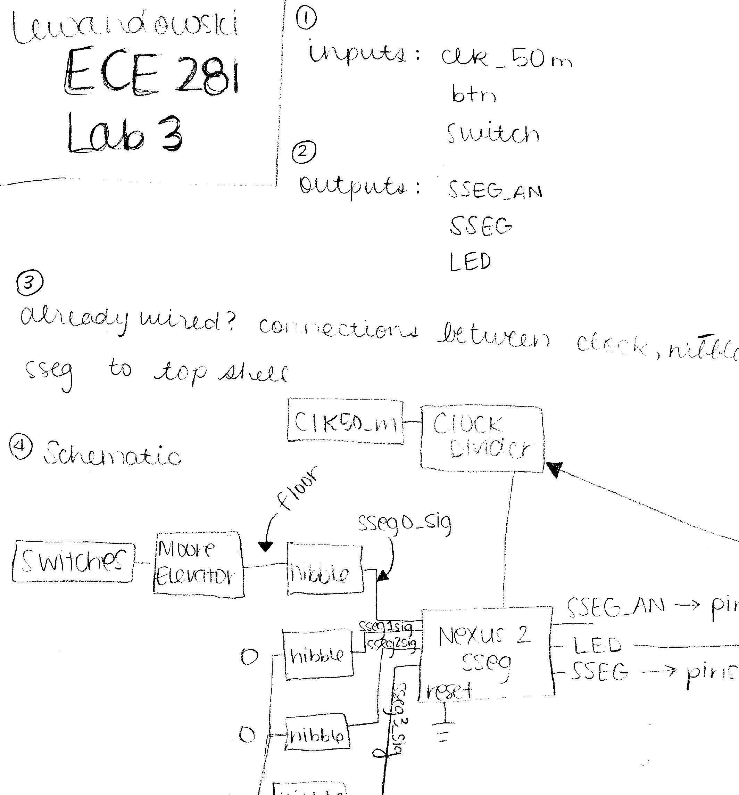

ECE281_Lab3
===========

#Prelab Schematic

#Demo Notes
Initial demo on M23 successfully completed
B Functionality Completed
  -More Floors with Prime Numbers: Successful
  -Change Inputs had some errors with the else statement so it didn't correctly go back down to floor zero
  
  
#Code Critique

"floor_state_machine: process(clk,reset)
begin
	if clk'event and clk='1' then
		if reset='1' then
			floor_state <= floor0;
		else
			floor_state <= next_floor_state;
		end if;	
	end if;
end process;	
	
next_floor_state_machine: process(floor_state, floorIn)
begin
		case floor_state is
		when floor0 =>
			if floorIn = "000" then ...."
			
The code above is an example where the flip flop part of the state machine, the part that works with the clock, is separate from the next state part of the state machine, the second process that we see the begining of. This eliminates several lines of code in addition to separating the two entities for better efficiency. The final block so to speak is the output logic, which would follow the next state logic. 		
